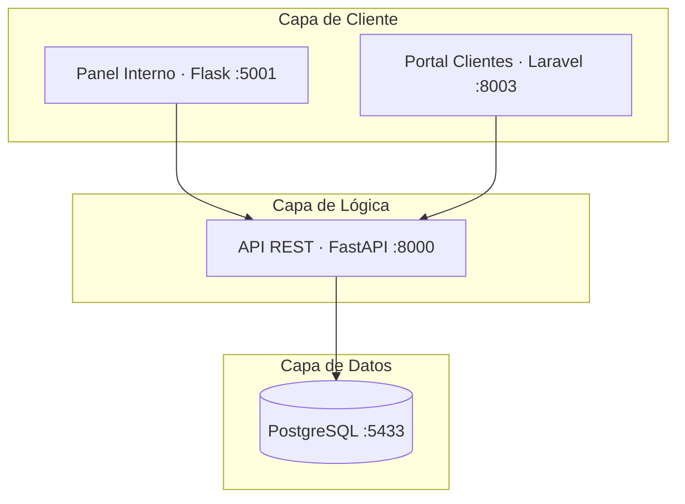

# 🚗 Macuin — Sistema de Gestión de Autopartes

Sistema integral de gestión de autopartes compuesto por una **API REST** (FastAPI), un **panel interno** (Flask) y un **portal de clientes** (Laravel), orquestados con **Docker Compose** sobre una base de datos **PostgreSQL**.

---

## Tabla de Contenidos

- [Arquitectura](#arquitectura)
- [Stack Tecnológico](#stack-tecnológico)
- [Requisitos Previos](#requisitos-previos)
- [Instalación Rápida](#instalación-rápida)
- [URLs de Acceso](#urls-de-acceso)
- [Credenciales de Demostración](#credenciales-de-demostración)
- [Estructura del Proyecto](#estructura-del-proyecto)
- [API FastAPI — Backend](#api-fastapi--backend)
- [Flask — Panel Interno](#flask--panel-interno)
- [Laravel — Portal de Clientes](#laravel--portal-de-clientes)
- [Base de Datos — PostgreSQL](#base-de-datos--postgresql)
- [Reportes y Exportaciones](#reportes-y-exportaciones)
- [Docker — Infraestructura](#docker--infraestructura)
- [Comandos Útiles](#comandos-útiles)
- [Solución de Problemas](#solución-de-problemas)
- [Plan de Desarrollo por Fases](#plan-de-desarrollo-por-fases)
- [Notas para Colaboradores](#notas-para-colaboradores)

---

## Arquitectura



```
┌─────────────────────────────────────────────────────┐
│                   macuin_network                    │
│                                                     │
│        ┌──────────────┐      ┌──────────────┐       │
│        │    Flask     │      │   Laravel    │       │
│        │    :5001     │      │    :8003     │       │
│        └──────┬───────┘      └──────┬───────┘       │
│               │                     │               │
│               └──────────┬──────────┘               │
│                          ▼                          │
│                  ┌──────────────┐                   │
│                  │  API FastAPI │                   │
│                  │    :8000     │                   │
│                  └──────┬───────┘                   │
│                         │                           │
│                         ▼                           │
│                  ┌──────────────┐                   │
│                  │  PostgreSQL  │                   │
│                  │    :5433     │                   │
│                  └──────────────┘                   │
└─────────────────────────────────────────────────────┘
```

---

## Stack Tecnológico

| Servicio | Tecnología | Versión | Propósito |
| :--- | :--- | :--- | :--- |
| **Backend API** | Python / FastAPI | 3.11 | Lógica de negocio, CRUD y persistencia |
| **Panel Interno** | Python / Flask | 3.11 | Interfaz web para personal (Admin, Ventas, Logística, Almacén) |
| **Portal Clientes** | PHP / Laravel | 11.x | Catálogo, carrito, pedidos y registro de clientes |
| **Base de Datos** | PostgreSQL | 15 | Almacenamiento relacional |
| **Infraestructura** | Docker | Compose V2 | Orquestación de todos los servicios |

---

## Requisitos Previos

- [Docker Desktop](https://www.docker.com/products/docker-desktop/) instalado y corriendo
- [Git](https://git-scm.com/) instalado
- Puertos **5433**, **8000**, **5001** y **8003** disponibles

---

## Instalación Rápida

```bash
# 1. Clonar el repositorio
git clone https://github.com/DnielCC/Macuin.git

# 2. Entrar a la carpeta
cd Macuin

# 3. Ejecutar el script de configuración
bash setup.sh
```

> **¿Qué hace `setup.sh`?**
> - Verifica que Docker esté instalado y corriendo
> - Construye las imágenes y levanta los contenedores
> - Crea automáticamente las tablas en PostgreSQL (`Base.metadata.create_all`)
> - Ejecuta el seed inicial (roles, estatus, usuario sistema)
> - Configura dependencias de Laravel y limpia caché
> - Verifica que todos los servicios estén respondiendo

---

## URLs de Acceso

| Servicio | URL | Descripción |
|---|---|---|
| **API FastAPI** | http://localhost:8000 | Backend REST |
| **Swagger / Docs** | http://localhost:8000/docs | Documentación interactiva de la API |
| **Panel Flask** | http://localhost:5001 | Panel interno por roles |
| **Portal Laravel** | http://localhost:8003 | Portal para clientes |
| **PostgreSQL** | `localhost:5433` | Acceso a la BD desde el host |

---

## Credenciales de Demostración

### Panel Interno (Flask) — `http://localhost:5001/login`

Se crean/actualizan ejecutando:
```bash
docker exec macuin_api python scripts/seed_macuin_demo_users.py
```

| Rol | Correo | Contraseña |
|---|---|---|
| **Administrador** | `admin@macuin.com` | `admin123` |
| **Ventas** | `ventas@macuin.com` | `ventas123` |
| **Logística** | `logistica@macuin.com` | `logistica123` |
| **Almacén** | `almacen@macuin.com` | `almacen123` |

### API (HTTP Basic Auth)

Los endpoints protegidos usan autenticación Basic con las variables `API_BASIC_USER` y `API_BASIC_PASSWORD`:

| Campo | Valor (desarrollo) |
|---|---|
| Usuario | `alidaniel` |
| Contraseña | `123456` |

### Base de Datos

| Campo | Valor |
|---|---|
| Host | `localhost` (externo) / `postgres` (entre contenedores) |
| Puerto | `5433` (host) → `5432` (contenedor) |
| Base | `DB_macuin` |
| Usuario | `macuin` |
| Contraseña | `123456` |
| JDBC URL | `jdbc:postgresql://127.0.0.1:5433/DB_macuin` |

> ⚠️ **Seguridad:** Estas credenciales son **solo para desarrollo**. En producción, sustituir contraseñas y rotar secretos.

---

## Estructura del Proyecto

```
Macuin/
├── API/                        # Backend FastAPI (Python)
│   ├── main.py                 # Punto de entrada, CORS, registro de routers
│   ├── router/                 # Endpoints agrupados por dominio
│   ├── database/               # Modelos SQLAlchemy (ORM)
│   ├── models/                 # Esquemas Pydantic (validación)
│   ├── security/               # Autenticación HTTP Basic
│   ├── scripts/                # Seeds y utilidades
│   ├── Dockerfile
│   └── requirements.txt
│
├── Flask/                      # Panel interno (Python)
│   ├── main.py                 # Application factory
│   ├── routes/                 # Blueprints por módulo/rol
│   │   ├── auth_segment.py     # Login / logout
│   │   ├── admin_segment.py    # Módulo Administrador
│   │   ├── ventas_segment.py   # Módulo Ventas
│   │   ├── logistica_segment.py # Módulo Logística
│   │   ├── almacen_segment.py  # Módulo Almacén
│   │   └── reportes_segment.py # Generación de reportes
│   ├── services/               # Clientes HTTP hacia la API
│   ├── templates/              # Plantillas Jinja2
│   ├── static/                 # CSS, JS, imágenes
│   ├── Dockerfile
│   └── requirements.txt
│
├── Laravel/                    # Portal de clientes (PHP)
│   ├── app/Http/Controllers/   # Controladores
│   ├── app/Models/             # Modelos Eloquent
│   ├── routes/web.php          # Rutas web
│   ├── resources/views/        # Vistas Blade
│   ├── database/migrations/    # Migraciones Laravel
│   ├── nginx.conf              # Configuración del servidor web
│   ├── Dockerfile
│   └── composer.json
│
├── scripts/                    # Scripts SQL y PowerShell auxiliares
├── docker-compose.yml          # Orquestación de servicios
├── setup.sh                    # Script de instalación automática
└── README.md                   # ← Este archivo
```

---

## API FastAPI — Backend

### Punto de entrada

- **Archivo:** `API/main.py`
- Configura CORS, registra todos los routers con prefijo `/v1/`, manejo global de `IntegrityError` (código 409).

### Endpoints por módulo (`API/router/`)

| Router | Prefijo | Descripción |
|---|---|---|
| `auth.py` | `/v1/auth` | Autenticación y login |
| `usuarios.py` | `/v1/usuarios` | CRUD usuarios internos |
| `clientes.py` | `/v1/clientes` | Gestión de clientes |
| `autopartes.py` | `/v1/autopartes` | CRUD autopartes + búsqueda |
| `categorias.py` | `/v1/categorias` | Categorías de autopartes |
| `marcas.py` | `/v1/marcas` | Marcas de autopartes |
| `pedidos.py` | `/v1/pedidos` | Pedidos, detalles, cambio de estatus, cancelación |
| `inventarios.py` | `/v1/inventarios` | Inventario por autoparte |
| `movimientos_inventario.py` | `/v1/inventarios/{id}/movimientos` | Entradas y mermas de stock |
| `ubicaciones.py` | `/v1/ubicaciones` | Ubicaciones de almacén |
| `direcciones.py` | `/v1/direcciones` | Direcciones de envío |
| `guias_envio.py` | `/v1/guias-envio` | Guías de envío |
| `estatus_pedido.py` | `/v1/estatus-pedido` | Catálogo de estatus |
| `carritos.py` | `/v1/carritos` | Carrito de compras + líneas |
| `pagos.py` | `/v1/pagos` | Registro de pagos |
| `reportes.py` | `/v1/reportes` | 4 tipos de reportes JSON |
| `parametros_sistema.py` | `/v1/parametros-sistema` | Configuración del sistema |
| `portal_contacto.py` | `/v1/portal-contacto` | Mensajes de contacto del portal |
| `roles.py` | `/v1/roles` | Catálogo de roles |
| `redireccion.py` | `/v1/redirect` | Redirección entre portales |

### Características clave

- **Mutaciones protegidas** con HTTP Basic (`API_BASIC_USER` / `API_BASIC_PASSWORD`)
- **CORS** configurable vía variable `CORS_ORIGINS`
- **Manejo de conflictos:** `commit_or_raise` + manejador global `409` ante `IntegrityError`
- **Documentación OpenAPI:** http://localhost:8000/docs

---

## Flask — Panel Interno

### Descripción

Panel web para el personal interno segmentado por roles:

| Rol | Módulos principales |
|---|---|
| **Administrador** | Usuarios, catálogo, pedidos, reportes, configuración |
| **Ventas** | Clientes, pedidos, catálogo (lectura) |
| **Logística** | Envíos, direcciones, guías, pedidos |
| **Almacén** | Inventario, ubicaciones, movimientos, autopartes (lectura) |

### Estructura de rutas (`Flask/routes/`)

| Archivo | Descripción |
|---|---|
| `auth_segment.py` | Login / logout con validación contra la API |
| `admin_segment.py` | CRUD completo para Administrador |
| `ventas_segment.py` | Gestión de ventas y clientes |
| `logistica_segment.py` | Seguimiento de envíos |
| `almacen_segment.py` | Control de inventario y stock |
| `reportes_segment.py` | Generación y descarga de reportes |
| `core_segment.py` | Rutas comunes (dashboard, health) |

### Consumo de la API

Flask **no accede directamente a la base de datos**. Todas las operaciones pasan por `Flask/services/api.py`, que realiza llamadas HTTP a FastAPI.

---

## Laravel — Portal de Clientes

### Descripción

Portal público orientado al cliente con las siguientes funcionalidades:

- **Registro e inicio de sesión** de clientes
- **Catálogo de autopartes** con filtros
- **Carrito de compras** y proceso de pedido
- **Historial de pedidos** por cliente
- **Formulario de contacto**

### Archivos clave

| Archivo / Carpeta | Propósito |
|---|---|
| `routes/web.php` | Definición de rutas principales |
| `app/Http/Controllers/` | Controladores del portal |
| `app/Models/Macuin/` | Modelos Eloquent para tablas compartidas |
| `resources/views/` | Plantillas Blade |
| `database/migrations/` | Migraciones (`users`, `sessions`, etc.) |

### Conexión con el sistema

Laravel comparte la misma base de datos PostgreSQL (`DB_macuin`). Para ciertas vistas (como listado de pedidos), lee directamente con Eloquent. La **lógica de negocio y el CRUD principal** permanecen en FastAPI.

---

## Base de Datos — PostgreSQL

### Modelo de datos

Todas las tablas son definidas como **modelos SQLAlchemy** en `API/database/`. SQLAlchemy resuelve el orden de creación automáticamente según las claves foráneas.

| Tabla | Archivo | Descripción |
|---|---|---|
| `roles` | `rol.py` | Catálogo de roles (Admin, Ventas, Logística, Almacén) |
| `usuarios` | `usuario.py` | Personal interno del sistema |
| `clientes` | `cliente.py` | Clientes del portal |
| `direcciones` | `direccion.py` | Direcciones de envío |
| `categorias` | `categoria.py` | Categorías de autopartes |
| `marcas` | `marca.py` | Marcas de autopartes |
| `autopartes` | `autoparte.py` | Catálogo de productos |
| `inventarios` | `inventario.py` | Stock por autoparte |
| `movimientos_inventario` | `movimiento_inventario.py` | Entradas y mermas de stock |
| `ubicaciones` | `ubicacion.py` | Ubicaciones físicas de almacén |
| `estatus_pedido` | `estatus_pedido.py` | Catálogo de estatus de pedido |
| `pedidos` | `pedido.py` | Cabecera de pedidos |
| `detalles_pedidos` | `detalle_pedido.py` | Líneas de pedido (N productos) |
| `guias_envio` | `guia_envio.py` | Guías de envío |
| `parametros_sistema` | `parametro_sistema.py` | Configuración del sistema |
| `carritos` | `carrito.py` | Carrito de compras |
| `carrito_lineas` | `carrito.py` | Líneas del carrito |
| `pagos` | `pago.py` | Registros de pago |
| `contact_messages` | `contact_messages.py` | Mensajes de contacto |

### Relaciones principales

- **Cliente** 1—N **Direcciones** (`direcciones.cliente_id`)
- **Usuario** N—1 **Rol**; dirección empleado opcional
- **Autoparte** N—1 **Categoría**, N—1 **Marca**; 1—1 **Inventario**
- **Inventario** 1—N **Movimientos**, N—1 **Ubicación** (opcional)
- **Pedido** N—1 **Usuario**, N—1 **Estatus**, N—1 **Dirección**; 1—N **Detalles**; 1—N **Guías**
- **Detalle_pedido** N—1 **Autoparte**; columna generada `subtotal`
- **Carrito** 1—N **Carrito_lineas**; cada línea N—1 **Autoparte**

### Cobertura por módulo

| Área | Tablas que utiliza |
|---|---|
| Admin | `usuarios`, `roles`, `autopartes`, `categorias`, `marcas`, `pedidos`, `detalles_pedidos`, `estatus_pedido`, `parametros_sistema` |
| Ventas | `clientes`, `direcciones`, `pedidos`, `detalles_pedidos`, `autopartes` |
| Logística | `pedidos`, `estatus_pedido`, `direcciones`, `guias_envio` |
| Almacén | `inventarios`, `movimientos_inventario`, `ubicaciones`, `pedidos`, `autopartes` |
| Portal clientes | `autopartes`, `categorias`, `marcas`, `carritos`, `carrito_lineas`, `pagos`, `pedidos` |

### Seed inicial

Al ejecutar `setup.sh`, se corre `API/scripts/init_db.py` que crea las tablas faltantes y, si `roles` está vacío, inserta:
- Roles: Administrador, Ventas, Logística, Almacén
- Estatus: Borrador, Pendiente, Procesando, Enviado, Entregado, Cancelado
- Usuario sistema: `sistema@macuin.local`

### Nota sobre migraciones

Laravel tiene migraciones propias (`users`, `sessions`, etc.) que conviven en la misma base `DB_macuin`. `create_all` de SQLAlchemy **no altera columnas** en tablas ya existentes; si cambias modelos sobre una BD con datos hay que migrar manualmente o limpiar el volumen.

---

## Reportes y Exportaciones

### 4 tipos de reportes (API)

Disponibles en `API/router/reportes.py` bajo el prefijo `/v1/reportes`:

| Tipo | Endpoint | Roles con acceso |
|---|---|---|
| Pedidos | `GET /v1/reportes/pedidos` | Admin, Ventas, Logística, Almacén |
| Catálogo de autopartes | `GET /v1/reportes/catalogo-autopartes` | Admin, Ventas, Logística, Almacén |
| Usuarios internos | `GET /v1/reportes/usuarios-internos` | Solo Administrador |
| Inventario y almacén | `GET /v1/reportes/inventario-almacen` | Admin, Almacén |

### Exportación a archivos (Flask)

Desde el panel Flask (ruta `/reportes`), cada tipo se puede descargar en **3 formatos**:

| Formato | Librería |
|---|---|
| **PDF** | `reportlab` |
| **Word (.docx)** | `python-docx` |
| **Excel (.xlsx)** | `openpyxl` |

**Flujo:** `Flask/routes/reportes_segment.py` → `Flask/services/reports.py` (`render_pdf`, `render_docx`, `render_xlsx`) → datos desde la API vía `Flask/services/api.py`.

---

## Docker — Infraestructura

### Servicios y contenedores

| Servicio | Contenedor | Puerto Host | Puerto Contenedor | Imagen / Build |
|---|---|---|---|---|
| **PostgreSQL 15** | `macuin_db` | 5433 | 5432 | `postgres:15` |
| **FastAPI** | `macuin_api` | 8000 | 8000 | `./API/Dockerfile` |
| **Flask** | `macuin_flask` | 5001 | 5001 | `./Flask/Dockerfile` |
| **Laravel + Nginx** | `macuin_laravel` | 8003 | 8000 | `./Laravel/Dockerfile` |

### Red

Todos los servicios están conectados a la red interna `macuin_network` (driver `bridge`). Las comunicaciones entre contenedores usan nombres de servicio (ej: `http://macuin_api:8000`).

### Volúmenes

- **`postgres_data`** — Volumen persistente para datos de PostgreSQL
- **Código montado** — `./API:/app`, `./Flask:/app`, `./Laravel:/var/www/html` (hot-reload en desarrollo)

### Variables de entorno principales

| Variable | Servicio | Descripción |
|---|---|---|
| `DATABASE_URL` | API | Cadena de conexión PostgreSQL |
| `CORS_ORIGINS` | API | Orígenes permitidos para CORS |
| `API_BASIC_USER` / `API_BASIC_PASSWORD` | API, Flask | Credenciales HTTP Basic |
| `API_BASE_URL` | Flask, Laravel | URL de la API desde cada servicio |
| `DB_*` | Laravel | Conexión directa a PostgreSQL |

---

## Comandos Útiles

### Levantar y detener

```bash
# Levantar todo (construir si es necesario)
docker compose up --build -d

# Levantar un servicio específico
docker compose up --build -d api

# Detener todos los servicios
docker compose down

# Detener y borrar la base de datos (⚠️ destructivo)
docker compose down -v
```

### Ver logs

```bash
# Todos los servicios
docker compose logs -f

# Servicio específico
docker compose logs -f api
docker compose logs -f flask
docker compose logs -f laravel
docker compose logs -f postgres
```

### Gestión de contenedores

```bash
# Ver estado de los contenedores
docker compose ps

# Reiniciar un servicio
docker compose restart api

# Entrar a la base de datos
docker exec -it macuin_db psql -U macuin -d DB_macuin

# Entrar al contenedor de la API
docker exec -it macuin_api bash

# Entrar al contenedor de Laravel
docker exec -it macuin_laravel bash
```

### Crear tablas y datos iniciales

```bash
# Crear tablas faltantes + seed mínimo
docker exec macuin_api python scripts/init_db.py

# Seed de usuarios de demostración
docker exec macuin_api python scripts/seed_macuin_demo_users.py
```

### Laravel

```bash
# Limpiar caché
docker exec macuin_laravel php artisan optimize:clear

# Ejecutar migraciones
docker exec macuin_laravel php artisan migrate

# Permisos de storage
docker exec macuin_laravel chown -R www-data:www-data /var/www/html/storage
```

---

## Solución de Problemas

### La API no responde

```bash
docker compose logs api
docker exec macuin_db pg_isready -U macuin -d DB_macuin
```

### No puedo entrar como administrador en Flask

1. Verificar que la API esté corriendo: `docker compose ps`
2. Ejecutar el seed: `docker exec macuin_api python scripts/seed_macuin_demo_users.py`
3. Si dice "Usuario sin contraseña configurada", ejecutar el seed de nuevo
4. Credenciales: `admin@macuin.com` / `admin123`

### Laravel muestra error 500

```bash
docker exec macuin_laravel php artisan optimize:clear
docker exec macuin_laravel chown -R www-data:www-data /var/www/html/storage
```

### Puerto en uso

Si un puerto ya está ocupado, edita `docker-compose.yml` y cambia el puerto en la sección `ports` del servicio correspondiente.

### Reconstruir desde cero

```bash
docker compose down -v
docker compose up --build -d
bash setup.sh
```

---

## Plan de Desarrollo por Fases

### Fase 1 — Base de datos ✅

- PostgreSQL operativo con esquema de tablas creado vía SQLAlchemy
- Seed de datos iniciales (roles, estatus, usuario sistema)
- Conexión verificable desde cliente gráfico (JDBC)

### Fase 2 — API FastAPI ✅

- Endpoints REST completos para todos los módulos
- Autenticación HTTP Basic en mutaciones
- CORS configurado, documentación OpenAPI activa
- Flujos críticos probados contra PostgreSQL

### Fase 3 — Flask (Panel Interno) ✅

- Login real contra la API (no datos en memoria)
- CRUD completo para cada rol
- Reportes descargables en PDF, Word y Excel
- Datos reales en todos los dashboards

### Fase 4 — Laravel (Portal Clientes)

- Registro y login de clientes, catálogo con datos reales
- Carrito de compras, proceso de pedido y pago
- Historial de pedidos por cliente

### Fase 5 — Integración E2E

- Los tres frentes y la BD coordinados como un solo sistema
- Variables de entorno documentadas para cada contenedor
- Pruebas de regresión en Docker Compose

### Fase 6 — Calidad y Entrega

- Secretos no versionados, logs aptos para producción
- Backups de PostgreSQL y procedimiento de restauración
- Documentación completa para despliegue

---

## Notas para Colaboradores

1. **Puertos:** Asegúrate de que `8000`, `5001`, `8003` y `5433` estén libres en tu equipo.
2. **Entornos:** Los archivos `.env` se generan automáticamente con `setup.sh`, pero puedes personalizarlos.
3. **Hot-reload:** Los volúmenes montados en Docker permiten ver cambios sin reconstruir las imágenes.
4. **Base de datos:** `create_all` de SQLAlchemy no altera columnas existentes. Si cambias un modelo, recrea el volumen o migra manualmente.
5. **Issues:** Si encuentras un bug o necesitas una funcionalidad, repórtalo en GitHub Issues.
6. **Extensiones recomendadas:** En `.vscode/extensions.json` se recomiendan **Database Client** y **Database Client JDBC** para explorar la BD desde el editor.

---

*Macuin — Sistema de Gestión de Autopartes © 2026*