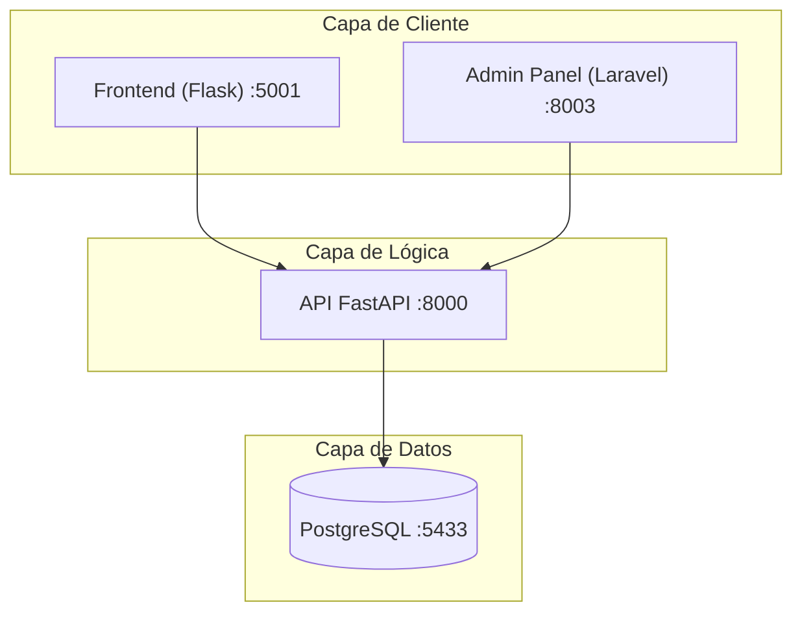

## Arquitectura del Proyecto

El sistema está dividido en componentes especializados que trabajan en conjunto bajo una red interna de Docker:



---

## Instalación Rápida

Si tienes **Docker Desktop** instalado y corriendo, puedes tener todo el proyecto funcionando con un solo comando:

```bash
# 1. Clona el repositorio
git clone https://github.com/DnielCC/Macuin.git

# 2. Entra a la carpeta
cd Macuin

# 3. Ejecuta el script de configuración mágica
bash setup.sh
```

> **¿Qué hace `setup.sh`?** Verifica tu entorno, levanta los contenedores, crea automáticamente las tablas en la base de datos, configura las dependencias de Laravel y limpia el caché.


## Stack Tecnológico

| Servicio | Tecnología | Versión | Propósito |
| :--- | :--- | :--- | :--- |
| **Backend API** | Python / FastAPI | 3.11 | Lógica de negocio y persistencia |
| **Web Frontend** | Python / Flask | 3.11 | Interfaz para el usuario final |
| **Admin Panel** | PHP / Laravel | 11.x | Gestión de inventario y roles |
| **Database** | PostgreSQL | 15 | Almacenamiento relacional |
| **Infraestructura** | Docker | Compose V2 | Orquestación de servicios |

---

## Documentación Detallada

Para guías específicas, consulta los siguientes manuales técnicos incluidos en este repositorio:

*   [**Guía de Docker**](./README_DOCKER.md) - Configuración de puertos, red y solución de problemas.
*   [**Documentación de la API**](./API/README.md) - Rutas, modelos y lógica de FastAPI.
*   [**Frontend Flask**](./Flask/README.md) - Desarrollo de la interfaz web.
*   [**Configuración Laravel**](./Laravel/README.md) - Gestión de Nginx y PHP.

---

## Notas para Colaboradores

1. **Puertos:** Asegúrate de que los puertos `8000`, `5001`, `8003` y `5433` estén libres en tu equipo.
2. **Entornos:** Los archivos `.env` se generan automáticamente con `setup.sh`, pero puedes personalizarlos si es necesario.
3. **Issues:** Si encuentras un bug o necesitas una funcionalidad, comentalo.